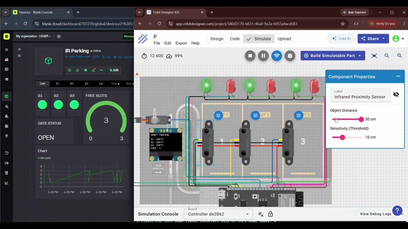

# Smart Parking System using ESP32 and Blynk

An IoT-based Smart Parking System using ESP32-S3 that monitors three parking slots in real time. The system uses IR sensors to detect vehicle presence, LEDs for slot indication, an OLED display for local monitoring, a servo-controlled gate, and a Blynk dashboard for remote monitoring.

## Features
- Real-time parking slot monitoring
- Automatic servo-controlled gate
- OLED display for local status
- Blynk dashboard for remote monitoring
- Parking usage history using SuperChart
- LED indicators for each parking slot

## Hardware Components
- ESP32-S3 Dev Board
- 3 × IR Sensors
- SG90 Servo Motor
- SSD1306 OLED Display
- 6 LEDs
- Jumper Wires

## Pin Configuration

| Component | Pin |
|-----------|-----|
| IR1 | GPIO13 |
| IR2 | GPIO12 |
| IR3 | GPIO14 |
| Servo | GPIO4 |
| OLED SDA | GPIO8 |
| OLED SCL | GPIO9 |

## Blynk Dashboard
- V0 → Slot 1 LED
- V1 → Slot 2 LED
- V2 → Slot 3 LED
- V3 → Available Slots + SuperChart
- V4 → Gate Status

# Smart Parking System using ESP32 and Blynk

## 🚗 Project Demo

## Features
- Real-time parking slot monitoring
- Automatic servo-controlled gate
- OLED display for local status
- Blynk dashboard for remote monitoring
- Parking usage analytics using SuperChart
- LED indicators for each parking slot

## Future Enhancements
- QR Code based parking entry
- Number Plate Recognition
- Cloud Database Integration
- Web Dashboard Analytics
